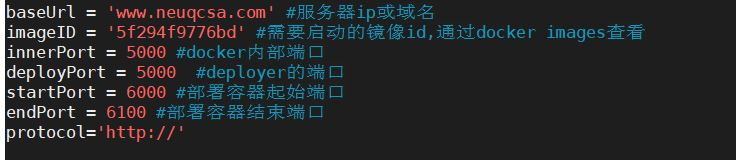
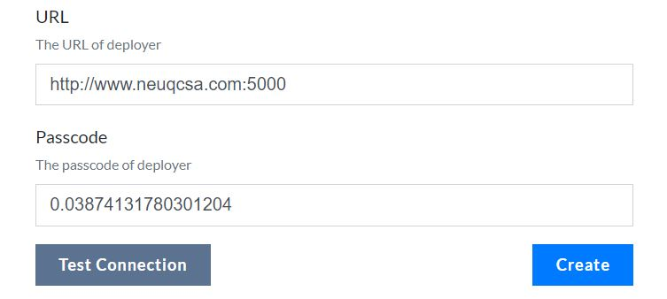
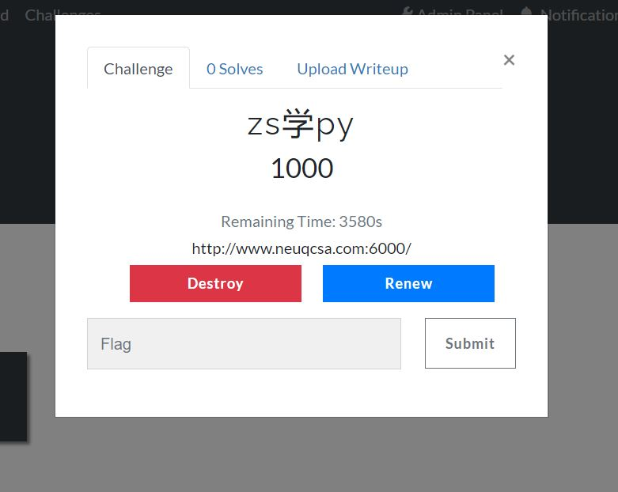

# CTFd-Fish
一个简单的CTFd插件，有两个功能：
* 动态部署靶机
* writeup上传

## 动态部署靶机
修改了SernRounder的[CTF_Machine_Deployer](https://github.com/SernRounder/CTF_Machine_Deployer)，然后和CTFd结合起来

相比赵总的[CTFd-Whale](https://github.com/glzjin/CTFd-Whale)自然是非常简陋的...既然赵总的叫Whale我这个就叫Fish吧...

简单的部署指南：
* 将CTF_Machine_Deployer/deployer.py放到服务器上，修改以下变量

一道题目对应一个deployer.py，多个题目就需要弄多个deployer.py...

* 启动deployer，比如`nohup python3 deployer.py > log.txt 2>&1 &`，然后记录log.txt中随机生成的passcode

* 在CTFd上新建challenge，选择CTFd-Fish类型，填入相关信息

可以使用Test Connection测试连接

* 启动靶机

一个用户只能同时启动一台靶机

## writeup上传
和我之前写的[dynamic_challenges_wp](https://github.com/LioTree/dynamic_challenges_wp)是一样的，上传的wp存放于CTFd根目录下的writeup文件夹内